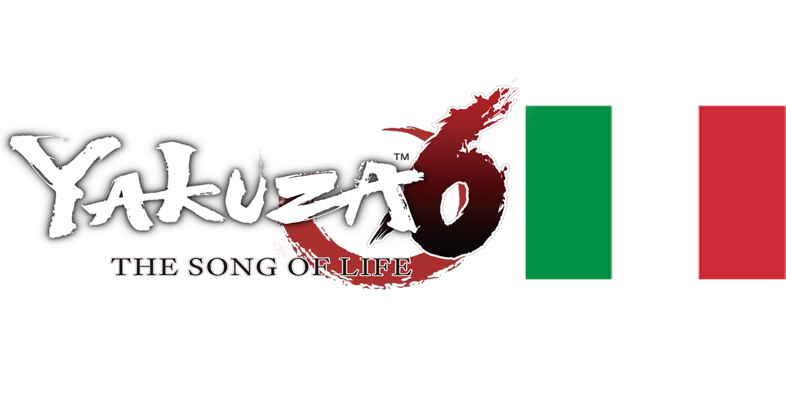
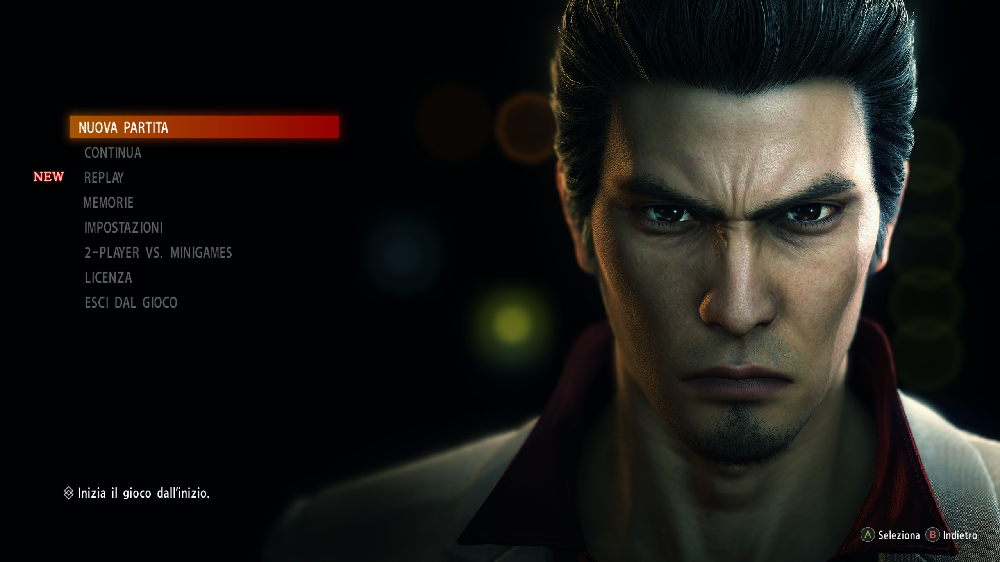
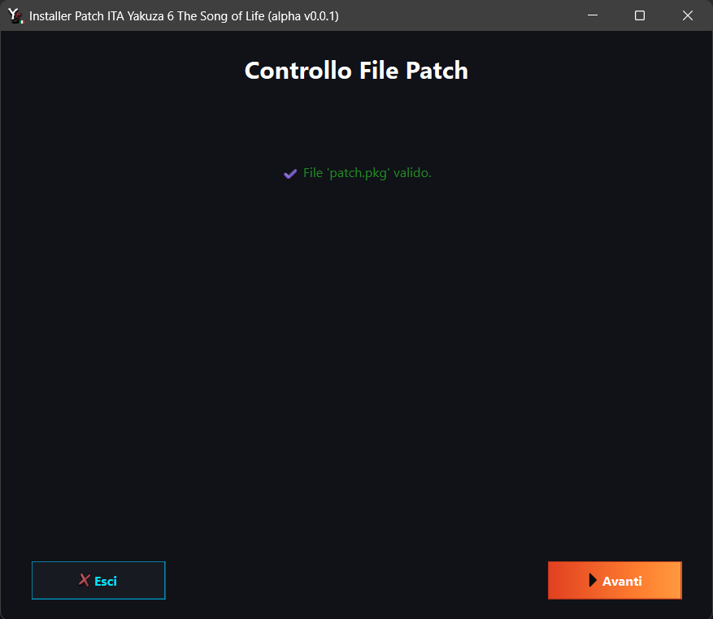
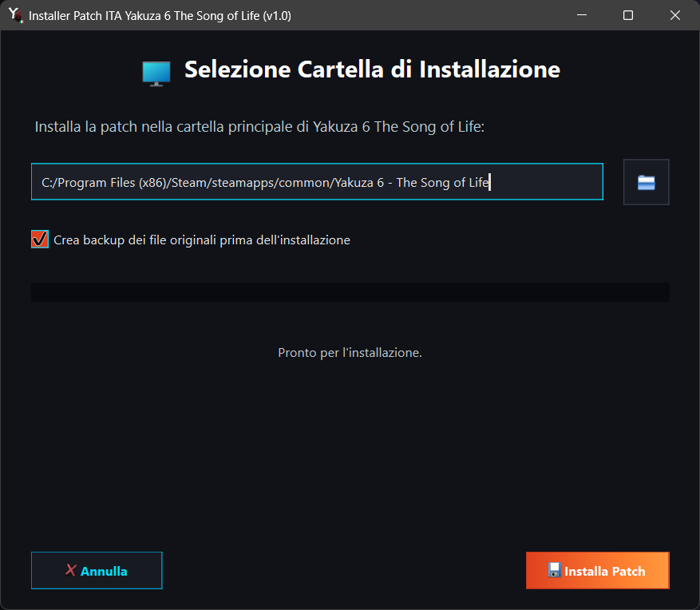

# Yakuza 6 The Song of Life Patch ITA
<p align="center">
  <br>
    Progetto per la traduzione del gioco Yakuza 6 The Song of Life in italiano.
</p>


[](https://www.paypal.com/paypalme/verio12)


Il "progetto" è nato totalmente a caso e spinto dalla mia curiosità di riuscire a modificare i testi del gioco, dopo aver provato la Patch per Yakuza 0 sviluppata da [Rulesless](https://letraduzionidirulesless.wordpress.com/yakuza0-2/). <br> La mia ricerca è iniziata cercando sul web l'esistenza di altre patch di traduzioni in altre lingue, per poter analizzare la patch e comprendere più velocemente quali siano i file contenenti i testi del gioco.<br> Per questo motivo ho iniziato ad analizzare la [patch spagnola](https://steamcommunity.com/sharedfiles/filedetails/?id=3385318071) del gioco.<p>
Analizzando i file, mi sono accorto che il gioco utilizza principalmente i file _PAR_ e _BIN_ (con varianti di questi ultimi in alcuni casi).I file PAR contengono i principali dati del gioco (immagini, animazioni ecc...) e lo stesso vale per i file BIN. Su GitHub ho casualmente trovato alcune repo che permettono di scompattare e ricompattare questi file; in tal modo ho iniziato a comprendere come muovere i primi passi per la traduzione dei testi del gioco.

# Immagini Patch




# Come installare la patch

Per installare bisogna selezionare la sezione [Releases](https://github.com/zSavT/Yakuza6-Patch-ITA/releases) su GitHub e selezionare l'ultima versione della patch disponibile. Selezionate l'installer da scaricare in base al sistema operativo scelto ed avviate l'installer.


L'installazione è guidata e semplice, ma in ogni caso basterà sempre cliccare su "_Avanti_". Attendere la verifica dell'integrità dei file della Patch e cliccare successivamente su "_Avanti_".



Successivamente bisogna accettare i termini d'uso e poi nella schermata successiva, selezionare la cartella dove è installato Yakuza 6 (Di default è impostato il percorso classico) e cliccare su "_Installa Patch_".



## Dove si trovano i salvataggi?

La posizione dei file di salvataggio di Yakuza 6: The Song of Life su PC può variare a seconda della piattaforma e del metodo di installazione:

*   **Steam:** I file di salvataggio principali si trovano in:
    `&lt;Percorso installazione Steam&gt;\userdata\&lt;Tuo ID Steam&gt;\1388590\remote\`
*   **GOG.com:** I salvataggi si trovano tipicamente in:
    `%LOCALAPPDATA%\GOG.com\Galaxy\Applications\56296606511683989\Storage\Shared\Files\`
*   **Microsoft Store:** I file di salvataggio sono memorizzati in:
    `%LOCALAPPDATA%\Packages\SEGAofAmericaInc.Yakuza6PC_s751p9cej88mt\LocalCache\Local\SEGA\Yakuza6\`
*   **Cartelle Alternative/Locali:** Alcune versioni potrebbero anche salvare i dati in:
    `%APPDATA%\Sega\Yakuza6\` (Windows) o `%LOCALAPPDATA%\Yakuza 6: The Song of Life\SaveGames\`


## Tool di decodifica

Il tool utilizzato per la traduzione si può trovare [qui](https://github.com/zSavT/Yakuza-6-Localization-Tool.git).

## Struttura dei file (Noti al momento)

Qui sotto è riportata la struttura dei file modificabili, con descrizione breve del file e l'avanzamento della traduzione/valutazione se tradurre o meno il file.

>= Sezione in elaborazione

# Funzionamento estrazione PAR

Per estrarre i dati dai file PAR, è necessario utilizzare il programma "_ParTool_", sviluppato da Kaplas80 e disponibile nella [repository](https://github.com/Kaplas80/ParManager.git). Nella cartella PAR è presente il tool per comodità, insieme a un file batch per ricompattare i file. Per scompattare un file PAR, è sufficiente trascinare il file sull'eseguibile; verrà creata una cartella contenente tutti i file presenti nel file PAR. Lo stesso processo, con maggiori opzioni, può essere eseguito tramite riga di comando (per maggiori informazioni, si può consultare la repository originale).

Per ricreare il file PAR dopo le modifiche, è possibile utilizzare il file batch (modificando, se necessario, solo i parametri di input e output) oppure tramite riga di comando, come nell'esempio seguente:

```
.\ParTool.exe create [nome cartella di input] [nome file par output] -c 1
```
Ovviamente, le parentesi quadre non devono essere incluse nel comando.


# Funzionamento installer

Per poter creare correttamente l'installer bisogna prima di tutto utilizzare ```packager.py``` per poter generare il file criptato della cartella "_data_". Lo script è guidato e bisogna solo indicare il percorso della cartella con le modifiche della Patch ed il nome del file pkg criptato. Nel file "chiave.txt" bisogna inserire la chiave di criptazione scelta.

## Creazione dell'eseguibile

Per poter generare l'eseguibile dello script bisogna utilizzare la libreria "__pyinstaller__" e generare l'eseguibile con i comandi in base al sistema operativo di arrivo.

### Windows

Per generare l'eseguibile dell'installer per Windows, bisogna utilizzare il seguente comando:
```ps
pyinstaller --onefile --windowed --hidden-import=webbrowser --hidden-import=pyzipper --hidden-import=sys --hidden-import=os --hidden-import=platform --hidden-import=traceback --hidden-import=PyQt6 --icon=assets/logo.png --add-data "assets:assets" --add-data "patch.pkg:." --add-data "chiave.txt:." installer.py
```

Nella cartella "_dist_", è presente l'eseguibile.

Per generare l'eseguibile per Linux, bisogna fare qualche passaggio in più. L'installer è creato tramite la WSL per Windows.
Per prima cosa bisogna creare l'ambiente virtuale per Python tramite il comando:
```ps
python3 -m venv venv
```
**Arch Linux / SteamOS (Steam Deck):**

```Bash
sudo pacman -S python-pip
```
**Fedora / RHEL / AlmaLinux:**

```Bash
sudo dnf install python3-pip python3-devel
```
**openSUSE:**

```Bash
sudo zypper install python3-pip python3-devel
```
#### Preparazione dell'ambiente virtuale
Una volta installate le dipendenze di base, la procedura è identica per tutti:


```Bash
python3 -m venv venv
```
Attiva l'ambiente
```Bash
source venv/bin/activate
```

Aggiorna pip e installa i requisiti
```Bash
pip install --upgrade pip
pip install pyinstaller PyQt6 pyzipper
```

#### Creazione dell'eseguibile
Con l'ambiente venv attivo, avvia il comando per la creazione del file eseguibile:

```Bash
pyinstaller --onefile --windowed --hidden-import=webbrowser --hidden-import=pyzipper --hidden-import=sys --hidden-import=os --hidden-import=platform --hidden-import=traceback --hidden-import=PyQt6 --icon=assets/logo.png --add-data "assets:assets" --add-data "patch.pkg:." --add-data "chiave.txt:." installer.py
```
Una volta terminato, puoi uscire dall'ambiente:

Una volta terminato, si può disattivare l'ambiente con il comando:
```ps
deactivate
```

Nella cartella dist troverai l'eseguibile per Linux (senza estensione).

# Altre patch della serie

Lista dei progetti di patch in italiano per i giochi della serie:
- [Yakuza 0](https://letraduzionidirulesless.wordpress.com/yakuza0-2/)
    - Come indicato nell'introduzione, la patch di Yakuza 0 completa al 100% (o quasi).
    - La versione Director's Cut presenta la lingua italiana.
- Yakuza Kiwami 1, 2 e 3
   - Ufficialmente tradotti in italiano nelle nuove versioni. 
- [Yakuza 4 Remastered](https://github.com/zSavT/Yakuza4-Patch-ITA)
    - Un'altra patch realizzata da me per la serie Yakuza è quella di Yakuza 4.
- [Yakuza 5 Remastered](https://github.com/zSavT/Yakuza5-Patch-ITA)
    - Un'altra patch realizzata da me per la serie Yakuza è quella di Yakuza 5.
- [Yakuza 6](https://github.com/zSavT/Yakuza6-Patch-ITA)
    - Questo progetto.


## Dipendenza e ringraziamenti
Si ringrazia

- Per la codifica e la decodifica dei file _PAR_ del gioco, si utilizza il programma sviluppato nella [repo](https://github.com/Kaplas80/ParManager.git) da Kaplas80.<br>
- Per la codifica e la decodifica dei file _reARMP_ del gioco, si utilizza il programma sviluppato nella [repo](https://github.com/Kaplas80/ParManager.git) da Ret-HZ.<br>

## Copyright
This patch does not contain copyrighted material, has no functional autonomy, and you must have your own original copy to apply it.
All game rights, intellectual property, logo/names, and movies/images are property of SEGA.

# Altri progetti di traduzione realizzati da me
[Valkyria Chronicles Patch ITA](https://github.com/zSavT/Valkyria-Chronicles-Patch-ITA)

[SoulFlow Patch ITA](https://github.com/zSavT/SoulFlow-Patch-ITA)

[Digimon Story Cyber Sleuth: Complete Edition](https://github.com/zSavT/Digimon-Story-Cyber-Sleuth-Patch-ITA.git)
